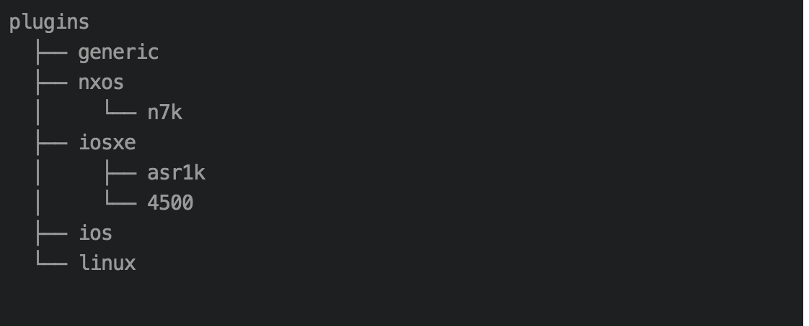

Plugin Implementation
=====================

Unicon plugins are the actual implementation, which defines the connections
class, services and state machine for the platform it is implementing.
Unicon provides a Connection factory class which will load these plugin
based on the input parameters

There are two methods of writing plugins for Unicon.

    1. by contributing directly to ``unicon.plugins`` source code under
       ``unicon.plugins repository``, and following the folder structure and
       examples there.

    2. by writing your own package, which installs using ``pip`` and extends
       Unicon functionality without having to modify the core Unicon code.

Both methods have their pros & cons. See below for details.

Contribution
------------

Any plugins contributed to Unicon code under the ``unicon.plugins`` repository,
becomes part of Unicon. This is a great method to use if your plugin
is generic, since it is installed automatically as part of every Unicon installation.

Doing so requires you to follow Unicon development and unittest guidelines, and
ultimately submit a pull-request to the Unicon source code repository. Once
verified by its developers, the next version of Unicon release will incorporate
your plugin.

Under this repository, Unicon follows a hierarchical directory structure for writing
plugins, which is distributed based on the OS, platform, model of the platform
which the plugin implements. Any new OS implementations will contribute to a
new sub-directory under ``unicon.plugins/plugins`` and its platform/model will go under that.

Unicon also has a generic plugin which implements the common behaviour seen across
various platform. For any unknown or not implemented os, unicon loads
generic plugin and uses its `Connection`, also generic platform will be used as
a reference/starting point for new platform implementation.

**Recommendations** :

  * We strictly recommend to follow generic plugins file and class structure
    while implementing your new platforms.

  * Also it is highly recommended to use the generic plugins Statemachine and services
    as the base class for your implementations statemachine and services.

Writing Your own Plugin
-----------------------

- If all you are looking for is to write plugins that support your own
  platforms without modifying the original Unicon code

- If you wish to own and support your own Unicon plugin that's installable via
  ``pip``

You should look into creating your own Unicon plugin package. Note that by
following this route, your new plugin will not be installed by default when
other developers perform ``pip install Unicon``, and will have to install your
plugin separately.

There are few major steps involved in creating your own plugin package:

    1. create the plugin module content following the instructions on this page
       on how to create a plugin.

       .. note::

           make sure the ``__init__.py`` of your top-level package imports
           and/or contains the implemented ``Connection`` plugin class.

    2. create the plugin package by writing a ``setup.py`` setup script. There
       are lots of online resources on this topic, eg `Writing a Setup Script`_.
    3. inside your new ``setup.py``, make sure to declare the following:

       .. code-block:: python

            setup(
                #...
                entry_points = {'unicon.plugins': ['<platform_name> = <module_name>']},
                #...
            )

       and replace ``<platform_name>`` with your platform's string name, and
       ``<module_name>`` being the name of plugin module you developed.

       .. note::

           valid plugin platform names: ``[A-Za-z_0-9]+``

       this will ensure the plugin gets discovered by Unicon upon import. If you
       are including multiple plugins within the same plugin package, simply
       further populate the list:

       .. code-block:: python

            setup(
                #...
                entry_points = {'unicon.plugins': [
                                        '<platform_name_1> = <module_name_1>',
                                        '<platform_name_2> = <module_name_2>',
                                        # ... etc
                                ]},
                #...
            )

And voila! Once your plugin is installed (either via ``pip install`` or
``python setup.py develop`` for development mode), it will be loaded
automatically by Unicon.

.. _Writing a Setup Script: https://docs.python.org/3/distutils/setupscript.html

For more details, follow the detailed Unicon plugin example
presented at https://github.com/CiscoDevNet/pyats-plugin-examples.

Implementing a New Platform
---------------------------

Creating a Unicon plugin for a new platform can be sub divided into four
main steps,

* Creating a Connection Class:
   * Defines all the attributes required for this connection.
* Writing Connection Provider:
   * Provides methods to connect and disconnect this platform
* Creating State Machine:
   * Defines all the supported states for this platform and handles state transitions
* Creating all required Services:
   * Defines all the supported services for this platform

Connection class
----------------
Connection class serves as the starting point for the device connection.
Unicon PluginManager is based on the platform to create the right connection class,
which in turn initializes all its required components,
such as connection provider, state machine, supported services and etc.

Users implementing a new platform have to define a ``Connection class``, with the required
parameters which are listed below in this section. The new ``Connection`` class
should satisfy the following conditions

    * It should be subclass (direct or indirect) of ``Connection``, ``BaseSingleRpConnection`` or ``BaseDualRpConnection``

    * ``Connection`` follows class hierarchy which is aligned/derived according to the os, platform and model

    * Based the chassis type, there should be a separate definition of the class

The ``Connection`` class takes the following mandatory parameters

========================= ========================================
Parameter                 Description
========================= ========================================
os                        OS for which the implementation is intended
platform                  Platform of this implementation
model                     Model which this implementation supports
chassis_type              Hardware chassis type single_rp, dual_rp or stack
connection_provider_class Class which implements actual step for connecting to a device
state_machine_class       State machine to be used
subcommand_list           List of subcommand supported
settings                  Settings to be used for this connection
========================= ========================================

``os`` and ``chassis_type`` of the implementation has to be mentioned in the connection.

.. code-block:: python

    # Example Connection class Nxos single Rp connection
    class NxosSingleRpConnection(BaseSingleRpConnection):
      os = 'nxos'
      platform = None
      chassis_type = 'single_rp'
      state_machine_class = NxosSingleRpStateMachine
      connection_provider_class = NxosSingleRpConnectionProvider
      subcommand_list = NxosServiceList
      settings = NxosSettings()

    # Example Connection class Nxos Dual Rp connection
    class NxosDualRPConnection(BaseDualRpConnection):
      os = 'nxos'
      platform = None
      chassis_type = 'dual_rp'
      state_machine_class = NxosDualRpStateMachine
      connection_provider_class = NxosDualRpConnectionProvider
      subcommand_list = HANxosServiceList
      settings = NxosSettings()

Base Connection (e.g `BaseSingleRpConnection<unicon.bases.routers.connection.BaseSingleRpConnection>`
and `BaseDualRpConnection<unicon.bases.routers.connection.BaseDualRpConnection>`) classes of
unicon defines the workflow of ``Connection`` and it satisfies all common needs of
router connection, the user may not need to override any of the methods unless there is
specific scenario to handle.

Connection Provider
-------------------
The connection class for any platform depends on the connection provider for initiating a
connection. As the name suggests, their role is to provide a method to let the
application connect and disconnect to the device.

This class provides two essential methods, namely ``connect`` and ``disconnect``.
The ``connect`` method defines all the steps involved in the connection process, which are
defined as separate methods. These steps vary
depending on the chassis type and the device, changing the behaviour of these
can be achieved by overriding the method corresponding to each step.

In the case of singleRP the steps involved in the connection process are:
  1. get_connection_dialog
  2. establish_connection
  3. init_handle

  This is handled by the `BaseSingleRpConnectionProvider<unicon.bases.routers.connection_provider.BaseSingleRpConnectionProvider>` class.

Whereas DualRp does a few additional steps like designate handles, initialize/unlock
standby, and assign ha mode.

  This is handled by the `BaseDualRpConnectionProvider<unicon.bases.routers.connection_provider.BaseDualRpConnectionProvider>` class.

Pattern
-------
For all patterns used by ``match_buffer``, eg. dialog, statemachine, expect,
by default, pty_backend match_buffer will detect the match mode.
It can be turned off by passing match_mode_detect=False to spawn or by changing settings.

Rules:

1. search the whole buffer with re.DOTALL if:

   - pattern contains any of: r'\n', r'\r', .
   - pattern equals to any of: r'.*', r'^.*$', r'.*$', r'^.*', r'.+', r'^.+$', r'.+$', r'^.+'

2. If the pattern ends with '$' but not r'\\$', match_buffer will only match the last line

3. In other situations, search the whole buffer with re.DOTALL

StateMachine
------------
The State Machine class holds the details of all supported states for a platform
and handles the transition of the device to different states.
Each platform has their own state machine class. The State Machine class provides
a ``create`` method where all the device states have to be created.
The State Machine should be sub class of ``StateMachine`` class from
``unicon.statemachine``

.. code-block:: python

  # State Machine for Nxos singleRP
  class NxosSingleRpStateMachine(StateMachine):

    def create(self):
        self.add_state(State('enable', '^.*%N#')); #%N here refers to hostname of device
        self.add_state(State('config', '^.*%N(config)#'))

        # Create a path
        self.create_path(enable, config, 'config term', None)
        self.create_path(config, enable, 'end', None)

..
  <TODO> Add link to detailed documentation here
  For more detailed document on state machine refer
  <link>

Creating New Services
---------------------
Refer detailed document :ref:`new-service-creation`

Settings
--------

Unicon Connection behavior can be changed by modifying its settings. The default
settings for unicon is 'unicon.setting.Settings', users can inherit and
change these settings if they wish to provide any platform or plugin level
setting. Unicon ``Connection`` class takes additional input settings, which
can be used to provide plugin/platform level settings.

.. code-block:: python

    from unicon.settings import Settings
    class NxosSettings(Settings):
        def __init__(self):
            super().__init__()
            # Modify settings here
            self.EXEC_TIMEOUT = 100

**Recommendations** :

  * We strictly recommend to follow the generic plugins file and class structure
    while implementing your new platforms.

  * It is also highly recommended to use the generic plugins Statemachine and services
    as the base class for your implementation's statemachine and services.

Consider adding the `DEFAULT_HOSTNAME_PATTERN` attribute to the `Settings` object for the
`learn_hostname` feature to work. Refer :ref:`learn-hostname-feature`.
