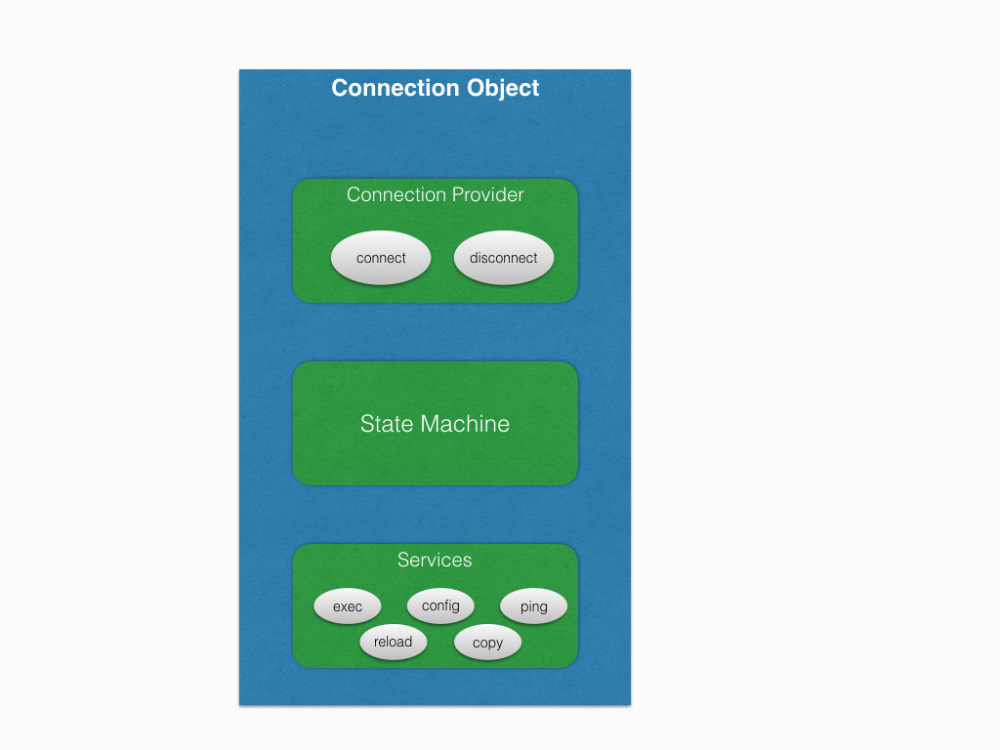
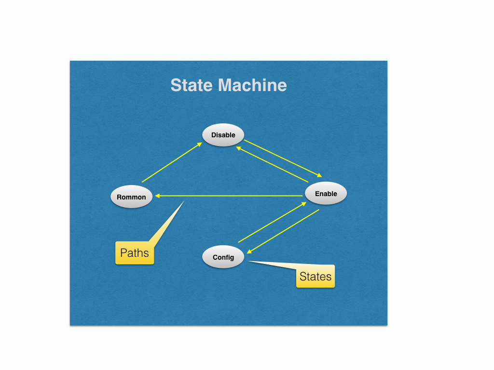

State Machine
=============

Statemachine is a major building block of a connection object. It enables the
connection handle to smoothly traverse across different *router states*.
This is how it fits into overall scheme of things.

We define *router states* as different *router modes*, e.g. enable, disable,
config, rommon etc. Hence statemachine provides a software abstraction of all
the router modes, and it keeps the connection library always in sync with the
actual device mode.

We need to implement the statemachine for all the platform implementations and
if this step is done correctly, we can safely assume that at least half of the
platform implementation is over.

In this chapter we will go through the important APIs and using an example
device we will try to implement a working statemachine.

Before you go further, please make sure you have gone through
:doc:`Expect Abstraction Library <../user_guide/eal>`

.. note::

    It is not mandatory that states must be a router mode. In dual
    rp connections, we even treat *standby locked* also as one of the states.
    It all depends on how do we want to abstract to the device in software.

Structure
----------

The *statemachine* consists of following two things:

* **States**: Individual states representing one of the router modes.
* **Paths**: Migration paths between the states.

Following is the block diagram for the same.

State
---------

As said in the previous section, it depicts one of the router modes. We identify
a router mode using the prompt pattern. For example this is how we can define
the enable state and disable state.

.. code-block:: python
   :linenos:

   from unicon.statemachine import State
   # enable state
   enable = State('enable', r'^.*(%N-standby|%N-sdby|%N)*#\s?#')
   # disable state
   disable = State('disable', r'^.*(%N-standby|%N-sdby|%N)*#\s?>')
   # config state
   config = State('config', r'^.(%N\(config\))#\s?')

What is ``%N`` ? Since the hostname of the device is not known at the point of
creating states, hence it is a just a markup indicating hostname. All the ``%N``
would be replaced by the actual hostname of the device during runtime.

API Guide For State
-------------------

.. autoclass:: unicon.statemachine.statemachine.State
   :noindex:
   :members: __init__, add_state_pattern, restore_state_pattern

Path
----------

*Path* objects contain all the information for migrating from one state to
another. It requires the following arguments.

* **from_state**: state object from which migration will start. (mandatory)
* **to_state**: state object to which migration will end. (mandatory)
* **command**: command required to initiate the migration. (mandatory)
* **dialog**: dialog object for negotiating any interaction because of *command* (optional)

Continuing from the previous example, lets add a few ``Path``.

.. code-block:: python
   :linenos:

   from unicon.statemachine import State
   disable_to_enable = Path(disable, enable, "enable", None)
   enable_to_disable = Path(enable, disable, "disable", Dialog())
   enable_to_config = Path(enable, config, "config term", Dialog())
   config_to_enable = Path(config, enable, "end", None)

Please note that ``Dialog`` in above example will be different in all the lines,
based on the nature of interaction caused by the ``command``, a blank ``Dialog``
has been used just for example.

The ``command`` option can also be a callable function. This can be used in case
a single command sent with `sendline()` is not sufficient. Below example
sends an escape character and quits a telnet session as part of a state transition.

The arguments, `statemachine`, `spawn` and `context` are mandatory.

.. code-block:: python
   :linenos:

    def escape_telnet(statemachine, spawn, context):
        spawn.send('~')
        spawn.expect(r'telnet>\s?$', timeout=5)
        spawn.sendline('q')
    
    module_console_to_chassis = Path(module_console, chassis, escape_telnet, None)

Statemachine
-------------

To create a *statemachine* class, we need to subclass from ``StateMachine``,
which is the base class. This base class has all the relevant instrumentation
required for creating shortest paths between any two given states. It uses all
the ``Path`` instances to make way from any given state to any state. It
provides APIs required for state migration, which we shall see shortly.

Let's create a sample *statemachine* class. All the ``State`` and the ``Path``
instances, which we created above are eventually fed into the custom
statemachine class.

.. code-block:: python
   :linenos:

    from unicon.statemachine import StateMachine
    from unicon.statemachine import State
    from unicon.statemachine import Path
    class MyStateMachine(StateMachine):
        def create(self):
            # enable state
            enable = State('enable', r'^.*(%N-standby|%N-sdby|%N)*#\s?#')
            # disable state
            disable = State('disable', r'^.*(%N-standby|%N-sdby|%N)*#\s?>')
            # config state
            config = State('config', r'^.(%N\(config\))#\s?')
            # create all the paths
            disable_to_enable = Path(disable, enable, "enable", None)
            enable_to_disable = Path(enable, disable, "disable", Dialog())
            enable_to_config = Path(enable, config, "config term", Dialog())
            config_to_enable = Path(config, enable, "end", None)
            # add all the states to statemachine
            self.add_state(enable)
            self.add_state(disable)
            self.add_state(config)
            self.add_state(enable)
            # add all the paths to statemachine
            self.add_path(disable_to_enable)
            self.add_path(enable_to_disable)
            self.add_path(enable_to_config)
            self.add_path(config_to_enable)
    # at the time of creating statemachine instance you should be aware of the
    # hostname of the device.
    sm = MyStateMachine("<hostname>")

.. note::

    Please note that we don't want same ``State`` and ``Path`` instances to be
    reused by different *statemachine* classes. Hence we create ``State`` and
    ``Path`` instances inside the scope of *statemachine* class.

Using The StateMachine
-----------------------

Now that the *statemachine* instance is created, let's take it for a spin.
However, before we do so please ensure that you have already connected to the
device (statemachine doesn't know how to connect) and you have a ``spawn``
instance. It can be used against any ``spawn`` instance which is already
connected to the device.

Here is a sample run from the statemachine of a ``connection`` instance,
connected to a single rp IOS device.

.. code-block:: python
   :linenos:

    In [4]: sm = con.sm # con is the connection handle
    In [5]: s = con.spawn
    In [6]: # getting the current state
    In [7]: sm.current_state
    Out[7]: 'enable'
    In [8]: # to list all the states in statemachine
    In [9]: sm.states
    Out[9]: [enable, disable, config, rommon]
    In [10]: # to list all the paths, __str__ of paths have to tweaked for better legibility
    In [11]: sm.paths
    Out[11]:
    [enable->disable,
     enable->config,
     enable->rommon,
     disable->enable,
     config->enable,
     rommon->disable]
    In [13]: # to get a state object by name.
    In [14]: state = sm.get_state('enable')
    In [15]: type(state)
    Out[15]: unicon.statemachine.statemachine.State
    In [16]: state
    Out[16]: enable
    In [17]: # to get a path by name
    In [18]: path = sm.get_path('enable', 'disable')
    In [19]: type(path)
    Out[19]: unicon.statemachine.statemachine.Path
    In [20]: path
    Out[20]: enable->disable
    In [28]: # to move to any given state
    In [29]: sm.go_to('config', s)
    config term
    Enter configuration commands, one per line.  End with CNTL/Z.
    si-tvt-7200-28-41(config)#
    In [30]: sm.go_to('enable', s)
    end
    si-tvt-7200-28-41#
    In [31]:
    In [31]: # go to any valid state in the state machine.
    In [32]: sm.go_to('any', s)
     ''
    si-tvt-7200-28-41#
    si-tvt-7200-28-41#
    In [33]: sm.current_state
    Out[33]: 'enable'

.. _learn-hostname-feature:

``learn_hostname`` feature support requirements
-----------------------------------------------

Hostname pattern substitution using the ``%N`` markup is typically required
for routing and switching platforms that expect the hostname passed into the
unicon Connection object (or the pyATS device name being connected to)
to be already configured on the device in order for the state patterns
containing ``%N`` to match.

This feature enables connection to a device with an unknown hostname
configured.  It does so by analyzing the device prompt, learning a potentially
different hostname and then using that hostname for all subsequent
``%N`` markup substitutions.

All state patterns containing a chain of ``%N`` hostname variants must
specify them in a most-to-least-specific manner in order for this feature
to work correctly.  A hostname cannot be learned if none of the device's
state patterns contain the ``%N`` hostname markup.

Here's a simplified example from the generic plugin patterns illustrating this.
Note the final pattern in the chain is simply ``%N`` ::

    self.enable_prompt = r'^(.*?)(%N-standby|%N-stby|%N)(\(boot\))*#\s?$'

The connection provider object's ``establish_connection`` method is responsible
for driving this feature.

If for some reason, ``learn_hostname`` is unable to detect hostname then unicon
compares unicon buffer with default hostname pattern set to ``Settings``
Attribute ``DEFAULT_HOSTNAME_PATTERN``. Default value is
``r'RouterRP|Router|[Ss]witch|Controller|ios'``

API Guide For StateMachine
--------------------------

.. autoclass:: unicon.statemachine.StateMachine
   :members: __init__, current_state, create_state, add_state, get_state, remove_state, create_path, add_path, get_path, remove_path, find_all_paths, get_shortest_path, go_to, create, add_default_statements
   :noindex:

.. Putting All Together
.. ---------------------

.. Now based on the concepts learned above let's get our hands dirty with some real
.. code. From here on, we will try to create a statemachine class for one our
.. target platform. The target platform in this case is a router
