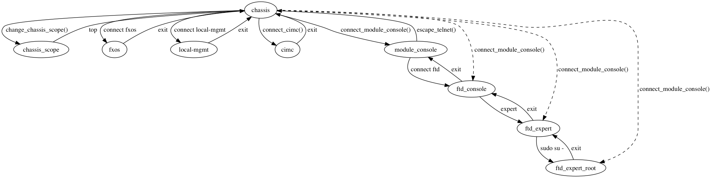

FXOS/FTD
========

This section lists the services which are supported with FXOS Firepower Threat Defence (FTD) Unicon plugin. This plugin is used when `os=fxos` and `platform=ftd` are specified.

  * `execute <#execute>`__
  * `switchto <#switchto>`__

The following generic services are also available:

  * send
  * sendline
  * expect
  * log_user

**Support CLI states**

The FXOS/FTD plugin supports a number of device CLI states, this is illustrated by the diagram below.
The `switchto` service can be used to switch between CLI states.

execute
-------

This service is used to execute arbitrary commands on the device. It is
intended to execute non-interactive commands. In case you want to execute
an command that uses interactive responses use `reply` option to specify
the Dialog object that handles the responses.

=============   ======================    =====================================================
Argument        Type                      Description
=============   ======================    =====================================================
command         str, list                 command(s) to execute
timeout         int (default 60 sec)      (optional) timeout value for the overall interaction.
reply           Dialog                    (optional) additional dialog object
=============   ======================    =====================================================

The `execute` service returns the output of the command in string format if a single command
is passed. If multiple commands are passed, the returned data is a dictionary with the commands
as keys and the responses as values. You can expect a TimeoutError, StateMachineError or
SubCommandFailure error in case anything goes wrong.

The commands to execute can be specified as a single command, a newline separated list of
commands or a list of commands.

.. code-block:: python

    >>> response = device.execute('show version')
    >>> type(response)
    <class 'str'>
    >>> 

    >>> response = device.execute('show version\nshow arp')
    >>> type(response)
    <class 'dict'>
    >>> 

    >>> response = device.execute(['show version','show arp'])
    >>> type(response)
    <class 'dict'>
    >>>

switchto
--------

This service is used to switch to a specific device CLI state. Supported states are:

* `chassis`
* `chassis scope \<path\>`
* `fxos`
* `local-mgmt`
* `cimc [<id>]`
* `module [<id>] console`
* `ftd console`
* `ftd expert`
* `ftd expert root`

The `<id>` identifiers are optional and default to `1`.

=============   ======================    =====================================================
Argument        Type                      Description
=============   ======================    =====================================================
target          str                       Target device CLI state
timeout         int (default 60 sec)      (optional) timeout value for the overall interaction.
=============   ======================    =====================================================

Examples:

.. code-block:: python

    >>> device.switchto('chassis')
    >>> 
    >>> device.switchto('ftd console')
    >>> 
    >>> device.switchto('module 1 console')
    >>> 
